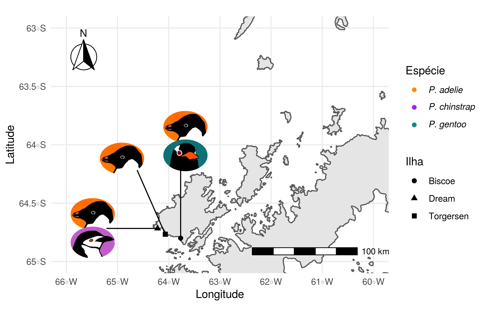
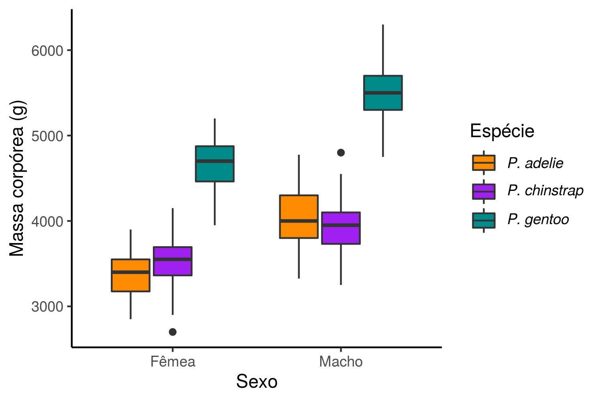

```{r setup, include=FALSE}
knitr::opts_chunk$set(echo = FALSE)

library(kableExtra)
```

## Resumo

Insira aqui o resumo que vai convencer as pessoas que estão prestes a ler o seu manuscrito a continuar. 

## Introdução

Os dados não falam por si só e precisam de contexto [@dignazio_data_2020]. 
Os pinguins antárticos são legais e apresentam dimorfismo sexual [@gorman_ecological_2014].

O objetivo desse trabalho é apenas mostrar como fazer um manuscrito usando rmarkdown. Os pinguins estão aqui porque eles são legais e podem ser diferentes dependendo da espécie e do sexo.

## Material e Métodos

Usaremos dados abertos coletados por @gorman_ecological_2014 disponíveis no pacote de R palmerpenguins [@allisonmhorst_allisonhorst_2020].

Os dados são referentes a medidas de 344 indivíduos de três espécies de pinguins do gênero *Pygoscelis*. As espécies ocorrem em três ilhas do arquipélago Palmer na Antártica. A espécie *P. adelie* é a única que ocorre nas três ilhas e co-ocorre com as demais espécies (Figura 1). 

```{r mapa, fig.cap = "Figura 1. Localização das três espécies de pinguins nas três ilhas do arquipélago Palmer."}

```


## Resultados

Uma variável que mostra a diferença entre os sexos é a massa corpórea (Figura 2). 

```{r boxplot, fig.cap = "Figura 2. Variação da massa corpórea entre machos e fêmeas das três espécies."}


```


Veja que interessante essa tabela.

```{r tabela}
tabela <- read.csv("../output/tabela_01.csv")
tabela$sp <- paste0('*', tabela$sp, '*')
names(tabela) <- c("Espécie", "Largura do bico (mm)",
                  "Comprimento do bico (mm)", "Comprimento da nadadeira (mm)")

tabela %>% 
  kable(caption = "Tabela 1. Média e desvio padrão das medidas do bico e nadadeira das três espécies") %>% 
  kable_styling()
```


## Discussão

Os pinguins são bonitinhos e parecem apresentar diferença entre os sexos. Não aprendemos muito mais sobre os pinguins, além deles serem legais porque os dados não significam quase nada sem contexto.

## Referências
