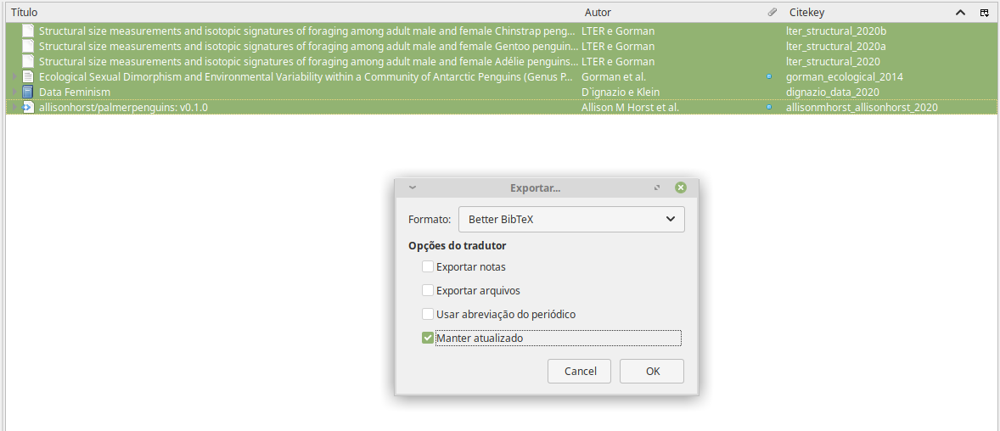
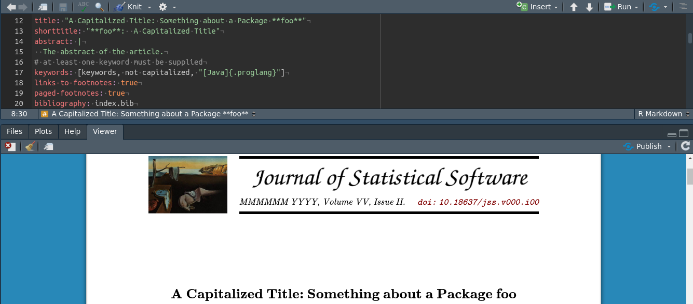

background-image: url("figs/liibre.png")
background-position: 98% 2%
background-size: 150px

```{r setup, include=FALSE}
options(htmltools.dir.version = FALSE)
knitr::opts_chunk$set(echo = FALSE)
```

```{r xaringan-themer, include = FALSE}
library(xaringanthemer)
style_duo_accent(
  primary_color = "#A70000",
  secondary_color = "#ff0000",
  white_color = "white",
  inverse_header_color = "white",
  inverse_background_color = "#A70000",
  header_font_google = google_font("Roboto Condensed"),
  text_font_google   = google_font("Roboto Condensed", "300", "300i"),
  code_font_google   = google_font("Ubuntu Mono"), text_font_size = "25px"
)
```


## apresentação


+ __Andrea Sánchez-Tapia__ Bióloga (UNAL - Colômbia),
MSc. Ecologia <br> (UFRJ), Dra. em Botânica (ENBT-JBRJ). Pós-Doc do Núcleo de <br> computação científica do JBRJ. Ecologia quantitativa, informática da biodiversidade, ENM/SDM


+ __Sara Ribeiro Mortara__
Bióloga (ESALQ/USP), MSc. Ecologia e Conservação da Biodiversidade (UESC) e Dra. em Ecologia (USP). Pequisadora do Instituto Internacional para a Sustentabilidade (IIS). Modelagem estatística

+ __¡liibre!__ Informática da biodiversidade, ciência aberta e reprodutível, ética na ciência de dados, [ciência de dados feminista](http://datafeminism.io/) 


---
class: middle
background-image: url("figs/logo_jbrj.png")
background-position: 98% 2%
background-size: 100px


### Disciplina _Projetos de análise de dados usando R_

.pull-left[

```{r, out.width= 400}
knitr::include_graphics("./figs/turma.JPG")
```


```{r, out.width= 150, fig.align = "center"}

#knitr::include_graphics("./figs/liibre.png")
```

]

.pull-right[
__Boas práticas__ em análise de dados

```{r, out.width=200, fig.align='center'}
knitr::include_graphics("./figs/rstudio.jpg")
```

```{r, out.width= 150}
knitr::include_graphics("./figs/logo-git.png")
knitr::include_graphics("./figs/GitHub_Logo.png")
knitr::include_graphics("./figs/btibucket.png")
knitr::include_graphics("./figs/gitlab-logo-gray-rgb.png")
```

```{r, out.width= 100}

knitr::include_graphics("./figs/bibtex.jpeg")
knitr::include_graphics("./figs/zotero.svg")
```
```{r, out.width= 50}
knitr::include_graphics("./figs/rmarkdown.png")
```

```{r, out.width= 60, fig.align='center', eval=FALSE}
knitr::include_graphics("./figs/xaringan.png")
```
]


---
background-image: url("https://raw.githubusercontent.com/LatinR/identidad-visual-latinR/master/LatinR_hex_violeta.png")
background-position: 98% 2%
background-size: 204px

## esta oficina 


+ Manuscrito acadêmico: tese/dissertação, artigos acadêmicos, <br> relatórios técnicos 
+ Fluxo de trabalho: como se organizar?__*__
+ Formatação de figuras e tabelas__*__
+ Citação__*__
+ Formatos finais, templates e modelos

---
## nosso fluxo de trabalho nunca é linear

+ Análise de dados é um processo iterativo

--

+ A redação de manuscritos também!

--

+ A gente está acostumada com word e similares... editores de texto __WYSIWYG - What you see is what you get__

--

+ __Muito fácil errar__ no processo de copiar e colar

--

+ __Paginação, formatação do documento e localização de figuras__ não são triviais ¬¬ 

--

+ O resultado gráfico é massomeno :/ 

---

## um fluxo de trabalho mais amigável

--

+ Escrever _durante_ o processo

--

+ Integrar o código e o texto

--

+ Apesar de separar escrita das análises

--

+ __Atualizar automaticamente__ se houver mudanças

--


+ Utilizar as vantagens de trabalhar com __scripts + controle de versões (git)__ para dar transparência e controlar a qualidade do trabalho 

--

+ Facilitar o processo de __citação__, __formatação__ e __submissão__

---
class: center


#### "typesetting": formatação, composição tipográfica

```{r, out.width=700}
knitr::include_graphics("figs/gut.jpeg")
```


---
## o pioneiro: <huge> $\LaTeX$ </huge>

+ Sistema de preparação de documentos com __alta qualidade tipográfica__

--

+ Baseado em __arquivos de texto__ (`.tex`). Formato de saída: __PDF__

--

+ Pode ser usado em [__controle de versões__]() como `git`

--

+ Lida corretamente com __notação__ matemática, científica, algebraica etc.

--

+ Muito poderoso com __paginação__ e __posicionamento de figuras__

--

+ Arquivos de $\LaTeX$ podem ser __submetidos__ como manuscritos para algumas revistas

--

+ __"_Templates_"__ de teses e dissertações em várias instituições

--

#### para aprender mais: [__overleaf__](https://www.overleaf.com/)  $\LaTeX$ online, sem instalar nada localmente. 

---
background-image: url(https://upload.wikimedia.org/wikipedia/commons/thumb/4/48/Markdown-mark.svg/1024px-Markdown-mark.svg.png)
background-size: 15%
background-position: 90% 5%

## markdown 

+ Mais simples do que $\LaTeX$ - e para muitas coisas isso é suficiente
--

+ Baseado em arquivos de texto `.md`, formato de saída __HTML__
--

+ Aceita tags de html e planilhas de CSS
--

+ Facilmente interpretado e renderizado por várias plataformas - inclusive GitHub (__README.md__)
--

### pandoc https://pandoc.org/
--

Um canivete suiço: conversor entre __muitos__ tipos de arquivo  

html, rtf, docx, 

---
background-image: url(https://bookdown.org/yihui/rmarkdown/images/hex-rmarkdown.png)
background-size: 150px
background-position: 98% 2%

## queremos incluir código!

--

+ _Literate programming_ (programação "letrada", [Knuth 1984](http://www.literateprogramming.com/knuthweb.pdf))

--

+ Integrar texto e código

--

 + $\LaTeX$ e R: __SWEAVE__ (`.Rnw`). Output em PDF.

--

 + markdown e R: __knitr__ (`.Rmd`). Output em markdown `.md`.
 
--

 + __knitr__ também sabe lidar com __.Rnw__ e gerar .tex $\LaTeX$

--

#### O pacote __rmarkdown__ usa __knitr__ para executar o código de R e gerar __pandoc__ e consegue gerar muitos formatos de saída.

---
background-image: url(https://bookdown.org/yihui/rmarkdown-cookbook/images/workflow.png)
background-size: contain

.footnote[https://bookdown.org/yihui/rmarkdown-cookbook/rmarkdown-process.html]

---
class: inverse, middle, center

# estrutura de um documento de rmarkdown

---
background-image: url(https://raw.githubusercontent.com/ThinkR-open/remedy/master/reference/figures/thinkr-hex-remedy.png)
background-size: 150px
background-position: 98% 2%

## ajuda para digitar: o pacote __remedy__

__remedy__ é instalado como um __Addin__ de RStudio

Você pode modificar os atalhos de teclado para que fique mais fácil escrever: 

`menu > ferramentas > modificar atalhos de teclado`

+ `ctrl + b` -> negrito
+ `ctrl + i` -> italico
+ `ctrl + k` -> link
+ `ctrl + 1` -> h1 (cabeçalho 1)
+ `ctrl + 2` -> h1 (cabeçalho 2)
+ `ctrl + r` -> insertar _chunk_ de código!

---
## para incluir plots

+ Gerar no _chunk_ com código puro (vai ficar salvo em uma pasta `files`)

--

+ Inserir uma figura externa:

--

  + Em sintaxe de markdown: ``

--

  + Em sintaxe de html: ``

--

  + Em sintaxe de $\LaTeX$: `\includegraphics{}`

--
 
#### O único que serve com todos os formatos é 

`````
```
*knitr::include_graphics(figura)
```
`````
(dentro de um _chunk_)

---
## incluir tabelas


.pull-left[

Formato padrão

`|   a|   b|   c|`  
`|-:|-:|-:|`  
`|   1|   2|   3|`  
`|   2|   3|   4|`  
]

.pull-right[
Resultado

|  a|  b|  c|
|--:|--:|--:|
|  1|  2|  3|
|  2|  3|  4|

]

--

+ Para gerar tabelas desde os chunks de R:
    + a função `kable()` de __knitr__ e o pacote __[kableExtra](https://cran.r-project.org/web/packages/kableExtra/vignettes/awesome_table_in_html.html)__ que dá mais opções

--

+ Para incluir qualquer tipo de output (por exemplo uma tabela de anova), o pacote __[pander](https://cran.r-project.org/web/packages/pander/vignettes/knitr.html)__

--

+ Existem serviços para gerar tabelas com este formato, como o __[markdown table generator](http://www.tablesgenerator.com/markdown_tables)__


---
class: center, middle, inverse

# Citação e gestão de bibliografias em rmarkdown (e <huge> $\LaTeX$ </huge>)

---
## gestão de bibliografia

+ __Gestor de bibliografias__: armazenam as citações, (opcionalmente os arquivos das publicações) e assistem a citação e criação de bibliografias

--

+ __Zotero__ e __Mendeley__, EndNote, Reference Manager  

--

+ Para citar em $\LaTeX$ e markdown: [BibTeX](http://www.bibtex.org/), formato: `.bib`

--

```{r remedy001}
toBibtex(citation("vegan"))
```

--

+ Formatação automática: arquivo de __estilo de citação__ `*.csl` 

---
## usando zotero ou mendeley

+ Uma __extensão no navegador__ faz _download_ da citação e do pdf se ele estiver disponível

--

+ Armazenamento e gestão de referências em um aplicativo local

--

+ Criar coleções específicas por temas/projetos

--

+ Um __conector__ para word e libreoffice (__Zotero__: Funcionalidade no google drive porém lentaaaa)

--

+ Um _site_ que cria as citações a partir da URL ou o DOI. [https://zbib.org/](https://zbib.org/)

--

+ Uma página de __estilos de citação__: [Zotero style repository](https://www.zotero.org/styles). Arquivos `.csl` 

--

+ __Zotero__: o addin __betterbibtex__ cria a chave de citação, exporta coleções em `.bib` e as mantém atualizadas

--

+ __Mendeley__: criar .bib para cada coleção, manter atualizado

---
## em mendeley

```{r}
knitr::include_graphics("./figs/mendeley.png")
```

---
## em Zotero

```{r}

```

---
## para citar em documentos de __rmarkdown__

+ Se `refs.bib` e `estilo.csl` estiverem na pasta `/citation`:

--

+ Incluir o `.bib` e o `.csl` da bibliografia no cabeçalho YAML do documento:
  + `bibliography: ../citation/refs.bib`
  + `csl: ../citation/nature.csl`

--

+ Citar usando o formato: `[@sobrenome_primeirapalavra_ano]` (olhar no zotero ou no mendeley a __chave de citação__)


---
## citação no rmarkdown

+ No __texto__, a citação é marcada assim: `@sobrenome_palavrachave_ano`

--

  + Ex. `[@dignazio_data_2020]` -> (D'Ignazio & Klein 2020)
  + Ex. `@dignazio_data_2020` -> D'Ignazio & Klein (2020)
  + Ex. `[@noble_algorithms_2018, @dignazio_data_2020]` -> (Noble 2018, D'Ignazio & Klein 2020)

--

+ O formato final depende do arquivo de estilo `.csl`

--

+ Pré-determinado: as referências completas são inseridas no final do texto

--

+ Se precisar colocar em outro lugar (por ex. porque tem apéndices, figuras, tabelas) Incluir:  
`<div id="refs"></div>` 


---
class: inverse, middle, center 

# formatos finais 
 
---
## exportando para .docx

+ Um documento de referência pro estilo: "template\_word.docx" com os estilos desejados modificados (__à mão desde word__) 

--

+ __No cabeçalho YAML__:

```
word_document:
    reference_docx: templates/template_word.docx
```

--

+ Para melhores resultados, é melhor __knitar uma vez__ sem template, __modificar__ o documento resultante e __usar esse documento resultante como template__.

--

+ __Alguns problemas com tabelas, páginas horizontais, vão persistir__ checar bem!

--

+ Para documentos `.odt` igual:  
`reference_odt: my-styles.odt`

---
## exportando para PDF

+ Tudo relacionado a PDF tem a ver com $\LaTeX$.

--

+ __rmarkdown__ aceita marcação de $\LaTeX$ no corpo do texto (ex. `\newpage`)

--

+ Templates e opções de $\LaTeX$ no YAML

--

+ Premite guardar o arquivo `.tex` intermediário

```yaml
output:
  pdf_document:
    template: quarterly-report.tex
    keep_tex: true
header_includes:
- \
```

--

+ Se for um _template_ complexo pode ser mais fácil escrever diretamente em $\LaTeX$. __Mesmo fluxo de trabalho__


---
## lidando com capítulos

+ O mais simples: um .Rmd com documentos "filhos"

--

ex. `child = 'introducao.Rmd'` nas opções de um chunk vazio


--

+ Permite manter estrutura de pastas/capítulos organizada

--

+ Funciona com os formatos de saída

--

+ Requer de __atenção com relação aos cabeçalhos YAML!__
(depende do formato de saída e depende da estrutura dos documentos)

--

#### Vamos para `Tese.Rmd` na pasta docs


---
## pacotes bookdown e [thesisdown](https://github.com/ismayc/thesisdown)

+ Permite juntar vários `.Rmd`  em um PDF único e incluir índice, referências...

--

+ [thesisdown](https://github.com/ismayc/thesisdown): Pacotes específicos para templates das universidades : variações são outros pacotes, ex. __coppedown__, __ufscdown__

--

+ `.Rmd` com cabeçalhos e templates de $\LaTeX$

---
## pagedown

+ paginação (separar em páginas) dos documentos de html 

--

+ um __passo direto de html a PDF__ 

--

+ formata com __templates CSS__, e modelos `.html` 

--

+ para documentos acadêmicos: `pagedown::thesis_paged()`

--

#### precisa editar o html e o CSS para fazer documentos em outra língua

---
## outros formatos pré-determinados de pagedown

```{r remedy003}

```

---
## pacote __rticles__

- O pacote __rticles__ tem vários templates de $\LaTeX$ aceitos pelas revistas (Elsevier, Frontiers, etc.)

--

- Temas novos são adicionados à versão de desenvolvimento: 

```
remotes::install_github("rstudio/rticles")
rticles::journals()
```

--

+ Só PDF e depende da disponibilidade de templates

---
class: inverse, middle

---
## conclusões 

- __Resista a tentação__ de fazer um documento só knitando o texto com todo o código (__Poder fazer ≠ dever fazer__): 
 
 - _Scripts_ e _outputs_ separados do documento

--

 - Vários capítulos: várias pastas

--

 -  Não escreva num `.Rmd` único!

--
 - __Flexibilidade__ na hora de fazer a formatação final

--

- Entenda os __formatos finais requeridos__ e sua disponibilidade em diferentes plataformas

--

- __Não escolha muito cedo mas não deixe para o final__ a decisão sobre formatação

---
## as boas práticas ainda aplicam

+ Cuidar da __estrutura de pastas__

--

+ __Modularizar__ o código de cada manuscrito/capítulo

--

+ Usar __caminhos relativos__

--

+ Usar __git__ para controle de versões


---
## referências

+ Rosanna van Hespen: Writing your thesis with R https://www.rosannavanhespen.nl/2016/02/16/writing-your-thesis-with-r-markdown-1-getting-started/

- R Markdown: The Definitive Guide https://bookdown.org/yihui/rmarkdown/

- R markdown cookbook: https://bookdown.org/yihui/rmarkdown-cookbook/

- https://rmarkdown.rstudio.com
https://bookdown.org/yihui/rmarkdown/interactive-documents.html

---
class: center

# ¡Gracias! 

`r icon::fa("twitter", colour = "#562457")` [@mortarasara](https://twitter.com/mortarasara) 
`r icon::fa("twitter", colour = "#562457")` [@SanchezTapiaA](https://twitter.com/SanchezTapiaA) 
`r icon::fa("twitter", colour = "#562457")` [@rladiesrio](https://twitter.com/rladiesrio) 

`r icon::fa("github", colour = "#562457")` `r icon::fa("gitlab", colour = "#562457")` 

`r icon::fa("r-project", colour = "#562457")` [R-Ladies+ Rio de Janeiro](https://www.meetup.com/pt-BR/rladies-rio/)

